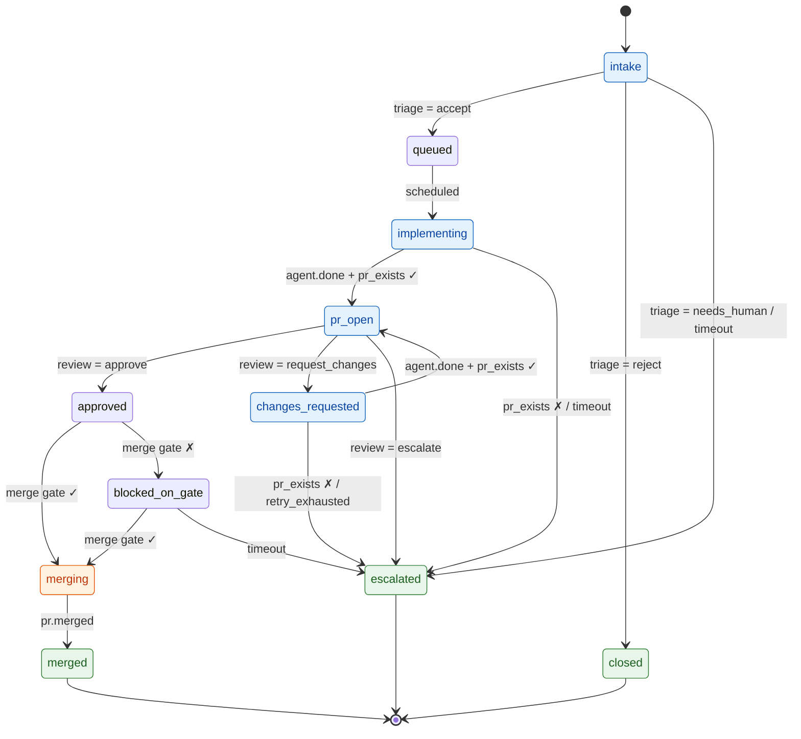

# Getting Started with Herdr Orchestrator

This is a hands-on walkthrough: from a clean checkout to driving a real GitHub
issue to a pull request. It complements the [README](README.md) (design +
reference) — read this first if you just want to *use* the tool.

**What the orchestrator does:** it turns a GitHub issue into a pull request by
driving [herdr](https://herdr.dev) — the execution substrate — through a fixed
state-graph engine that reads a declarative YAML workflow. You point it at an
issue; it spawns a coding agent in an isolated git worktree, waits for a PR,
spawns a reviewer, and (optionally) merges. The **engine** owns every state
transition; a model's judgment enters only at constrained `decision` points, and
the only irreversible step (merge) is reachable only through `gate` checks
against GitHub.

You'll go from zero to:
1. Building the single binary.
2. Validating and visualizing a workflow (no external dependencies — safe first step).
3. Driving one issue end-to-end with `run`.
4. Running the `daemon` to poll a label and drive many issues concurrently.
5. Observing and steering a live daemon over the MCP control surface.

---

## 1. Prerequisites

| Requirement | Why | Check |
|---|---|---|
| **Go 1.26+** | builds the binary (pure Go, no cgo) | `go version` |
| **herdr**, and you run the orchestrator *inside a herdr pane* | the execution backend shells out to `herdr` to create worktrees/panes and spawn agents | `echo $HERDR_ENV` should print `1` |
| **`gh`** (GitHub CLI), authenticated | PR detection, issue reads, reviews, merge | `gh auth status` |
| **An agent CLI on `PATH`** (default: `claude`) | the roles launch it to do the actual work | `which claude` |
| **A local checkout** of the target repo | the agent works in a worktree branched from it | — |

> **Important:** `run`, `recover`, and `daemon` must be launched **from within a
> herdr pane** (so `HERDR_ENV=1`). The `validate` and `plan` commands are pure —
> they touch nothing external and you can run them anywhere.

---

## 2. Get the code and build

```bash
git clone https://github.com/sean1588/herdr-orchestrator.git
cd herdr-orchestrator

# Build the single static binary.
go build -o orchestratord ./cmd/orchestratord

# Sanity check.
./orchestratord version
./orchestratord --help
```

`go build ./...` and `go test ./...` should both be green on a fresh clone.

---

## 3. First contact: validate and plan a workflow

The orchestrator is driven by a YAML **workflow** — a state graph plus the
roles, decisions, and gates it references. Before running anything, learn the two
read-only commands. They need no herdr, no `gh`, no network.

A ready-to-read example config ships in the repo. Point the commands at it:

```bash
CONFIG=internal/config/testdata/default-pipeline.yaml

# 1. Validate: JSON-Schema shape + the safety invariants (see below).
./orchestratord validate "$CONFIG"

# 2. Plan: render the resolved state graph, with terminal / side-effecting /
#    wait_for markers and any cycles (and whether they're bounded).
./orchestratord plan "$CONFIG"
```

`validate` runs two stages and refuses configs that fail either:

1. **Shape** — the config matches `workflow.schema.json`.
2. **Safety invariants** — e.g. every transition target is a real state; a
   `branch` on a decision covers exactly that decision's verdicts; a merge state
   is only reachable through a `gate` (never a bare decision or event); every
   cycle has a retry cap or a timeout (no non-terminating loops); the entry state
   names a declared state. (A state that's unreachable from the entry is a
   *warning*, not an error — `validate` still passes.)

Try it on the deliberately-broken example to see the invariants fire:

```bash
./orchestratord validate internal/config/testdata/broken-pipeline.yaml   # exits non-zero, lists the violations
```

**This is the habit to build:** every time you edit a workflow, `validate` then
`plan` it before you run it. A bad graph is caught here, statically, instead of
half-way through driving a real issue.

---

## 4. Understand the workflow you're about to run

Open `internal/config/testdata/default-pipeline.yaml`. Five sections matter:

- **`sources`** — where issues come from. The default polls the `github_issues`
  source `sean1588/minicode` for the label `agent-ready`. (Used by `daemon`; for
  a single `run` you name the issue directly.)
- **`roles`** — the agents. Each has a `launch` command (`["claude"]`), a
  `task_delivery` (`context_file` — the task is written to a file the agent
  reads, never piped through the terminal), and a `workspace` (`per_task` — a
  fresh git worktree per issue).
- **`decisions`** — the judgment points. `triage` and `review` are `llm`
  decisions, each with a **rubric** (a markdown file, e.g. `prompts/review.md`)
  and its own closed set of **verdicts** — `triage` → `accept` / `reject` /
  `needs_human`, `review` → `approve` / `request_changes` / `escalate`.
- **`gates`** — authoritative GitHub checks: `pr_exists`, `ci_green`,
  `approvals`, `no_conflicts`. Only a gate can unlock the merge.
- **`states`** — the graph itself. The default pipeline (from
  `default-pipeline.yaml`) is:



Blue states spawn (or resume) an agent; orange `merging` is the one
side-effecting state (the real merge, gated on `dry_run`); green states are
terminal — `merged` (success), `closed` (rejected), `escalated` (needs a human).
`blocked_on_gate` is the wait state: while the merge gate is failing it stays put
and re-checks each cycle, exiting to `merging` when the gate clears or to
`escalated` on timeout.

### The verdict-file protocol (important if you write your own rubrics)

For an `llm` decision, the engine **never judges** — it reads a verdict the agent
writes. When the engine spawns a decision role (triager/reviewer), the one-line
kickoff instructs the agent to write JSON to a file:

```json
{ "verdict": "approve", "feedback": "..." }
```

to `verdict-<taskID>.json` in the task directory. The engine validates that
`verdict` is one of the decision's declared verdicts and branches on it;
`feedback` is forwarded verbatim to the implementer on `request_changes`. The
shipped `prompts/triage.md` and `prompts/review.md` are examples — a rubric is
just the instructions your agent follows to reach one of the allowed verdicts.

> **Rubric paths resolve relative to the config file's directory.** If your
> config is `~/pipelines/default-pipeline.yaml` and references
> `rubric: prompts/review.md`, the engine looks for
> `~/pipelines/prompts/review.md`. Keep the `prompts/` folder next to your config.

---

## 5. Drive one issue end-to-end (`run`)

`run` drives a **single** issue through the graph. This is the best way to learn
the loop before turning on the daemon.

### 5.1 Set up a config with rubrics

Copy the example next to a `prompts/` folder:

```bash
mkdir -p ~/pipelines/prompts
cp internal/config/testdata/default-pipeline.yaml ~/pipelines/
cp internal/config/testdata/prompts/*.md ~/pipelines/prompts/
```

For a single `run` you name the issue on the command line, so the `sources`
block isn't consulted here — but it's read by the `daemon` later (§7) and it must
be valid, so set its `repo`/`label` to match your repo now:

```yaml
sources:
  - id: gh_issues
    type: github_issues
    repo: your-org/your-repo      # owner/name — used by the daemon's label poll
    select:
      label: agent-ready
    emits_to: intake
```

Leave `policies.dry_run: true` for now (it stops before the real merge).

### 5.2 Pick an issue

Choose a small, self-contained, clearly-specified issue in your repo — the kind
you'd hand a junior engineer with no follow-up questions. (That's exactly what
the `triage` decision checks for; vague issues get routed to `needs_human`.)

### 5.3 Launch from inside herdr

From a herdr pane (`echo $HERDR_ENV` → `1`):

```bash
./orchestratord run \
  --config ~/pipelines/default-pipeline.yaml \
  --repo   /path/to/your-repo-checkout \
  --issue  42 \
  --base   main \
  --db     ~/pipelines/orchestrator.db \
  --worktrees-dir ~/pipelines/worktrees \
  --task-dir      ~/pipelines/tasks
```

- `--repo` is your **local checkout** (the worktree is branched from it).
- `--worktrees-dir` / `--task-dir` are optional (defaults: a sibling dir of the
  repo, and a temp dir) — naming them explicitly makes the run easy to inspect.

What happens: the engine creates a task row, spawns the **triager** on the issue,
and reads its verdict. On `accept` the task moves to `queued`, which immediately
advances to `implementing` (the `scheduled` event auto-fires, so `queued` dwells
zero time — you'll still see both transitions in the audit log). Entering
`implementing` spawns the **implementer** in a fresh worktree. It writes code, pushes a
branch, and opens a PR. When the agent reports `done`, the engine checks the
**`pr_exists`** gate against GitHub (the authoritative signal — an agent saying
"done" only triggers the check), advances to `pr_open`, and spawns the
**reviewer**. On `approve` it reaches `approved`, evaluates the merge gate, and —
because `dry_run` is on — **halts at `merging`** and logs the merge it *would*
perform.

### 5.4 Inspect what happened

The store is a normal SQLite file. Look at the task and its audit trail:

```bash
sqlite3 ~/pipelines/orchestrator.db \
  "SELECT issue, current_state, pr_number FROM tasks;"

sqlite3 ~/pipelines/orchestrator.db \
  "SELECT ts, from_state, to_state, trigger, result
     FROM audit ORDER BY id;"
```

The audit log is append-only — one row per transition — so you can reconstruct
exactly how a task moved and why (e.g. `implementing → pr_open` on
`agent.done` / `pass`).

---

## 6. Going live: turning off dry-run

`policies.dry_run` is **on by default** and gates the single irreversible side
effect — the actual merge (not PR creation). With it on, the shipped config
halts at `merging` and logs the intended merge.

When you've watched a few runs and trust the loop, set `dry_run: false` in your
config. Now, once a task reaches `approved` and the merge gate
(`ci_green` + `approvals` + `no_conflicts`) passes, the engine runs
`gh pr merge --squash --delete-branch` and advances to `merged`. If the gate
*doesn't* pass (CI still running, no approval yet, conflicts), the task goes to
`blocked_on_gate` and is re-checked until it clears or times out.

> Keep `min_approved: 1` under the `approvals` gate for real repos — it means the
> orchestrator won't merge without a human (or another reviewer) approving on
> GitHub. Set it to `0` only for throwaway experiments.

---

## 7. Run the daemon (poll a label, drive concurrently)

`run` handles one issue. `daemon` polls your source's label and drives up to
`policies.max_concurrent_tasks` issues at once — one poller, N worker slots, a
single-writer store.

```bash
./orchestratord daemon \
  --config ~/pipelines/default-pipeline.yaml \
  --repo   /path/to/your-repo-checkout \
  --db     ~/pipelines/orchestrator.db \
  --worktrees-dir ~/pipelines/worktrees \
  --task-dir      ~/pipelines/tasks \
  --poll-interval 30s
```

Every `--poll-interval` the daemon lists open issues carrying your source's
`select.label` (`agent-ready`) — from the GitHub remote of your `--repo`
checkout — starts a task for each new one, and drives them concurrently up to the
concurrency cap. Label an issue `agent-ready` on GitHub and the next poll picks
it up; when a task settles (merged, closed, escalated — or halted at the dry-run
merge gate) the daemon removes the label so it isn't re-listed. Stop the daemon with `Ctrl-C` (SIGINT) — it cancels cleanly;
in-flight tasks resume on the next start via `recover` semantics.

---

## 8. Observe and steer a live daemon (MCP control surface)

The daemon can expose an optional **MCP server** so you (or a supervising agent)
can watch tasks and intervene — without killing the whole daemon. It's **off by
default**; enable it with `--mcp-listen`:

```bash
./orchestratord daemon \
  --config ~/pipelines/default-pipeline.yaml \
  --repo   /path/to/your-repo-checkout \
  --mcp-listen 127.0.0.1:7777
```

It speaks **JSON-RPC 2.0 over HTTP** (the request/response subset of MCP's
Streamable HTTP transport) on a single `/mcp` endpoint. Five tools:

| Tool | Args | What it does |
|---|---|---|
| `list_tasks` | — | all tasks and their current states |
| `get_task` | `issue` | one task by issue number |
| `get_audit` | `issue` | a task's full transition history |
| `cancel_task` | `issue` | cancel the running drive; it settles to `cancelled` |
| `enqueue_task` | `issue` | (re-)drive an issue; idempotent if already running |

Smoke-test it with `curl`:

```bash
# List every task the daemon is tracking.
curl -s 127.0.0.1:7777/mcp -d \
  '{"jsonrpc":"2.0","id":1,"method":"tools/call","params":{"name":"list_tasks","arguments":{}}}'

# Cancel the drive for issue 42.
curl -s 127.0.0.1:7777/mcp -d \
  '{"jsonrpc":"2.0","id":2,"method":"tools/call","params":{"name":"cancel_task","arguments":{"issue":42}}}'
```

**Semantics to know:**
- The control tools are **dispatch-acknowledged, not completion-acknowledged** —
  `cancel_task` confirms the cancel was *requested*; watch the effect with
  `get_task` / `get_audit`.
- `cancel_task` cancels that issue's drive and settles it to a reserved
  `cancelled` terminal. Its **worktree is preserved** (you may want to inspect
  uncommitted work); only the drive stops.
- **Security posture:** the listener binds to **loopback only and has no auth** —
  the bind address is the trust boundary. Don't expose the port off localhost.

---

## 9. Recover after a crash

Task state is durable (SQLite), so a killed daemon or `run` loses no ground. To
reconcile and resume everything in-flight:

```bash
./orchestratord recover \
  --config ~/pipelines/default-pipeline.yaml \
  --repo   /path/to/your-repo-checkout \
  --db     ~/pipelines/orchestrator.db
```

`recover` reloads each unsettled task, re-checks GitHub (the source of truth for
artifacts), and drives it forward from wherever it actually is. The `daemon`
does the same on startup, so in practice you just restart the daemon.

---

## 10. Troubleshooting & gotchas

- **"not running inside a herdr-managed pane" / backend errors** — you launched
  `run`/`daemon` outside herdr. Start it from a herdr pane so `HERDR_ENV=1` and
  the `herdr` CLI can reach the live session.
- **The agent sits idle after spawn** — the kickoff is delivered as a single line
  after a short submit delay; if you've heavily customized the launch command,
  confirm the agent actually received and submitted it. (The shipped path handles
  the Ink-TUI "swallowed Enter" quirk automatically.)
- **Unattended runs stall on permission prompts** — a coding agent gates each
  shell command by default. For hands-off runs, pre-authorize it: a
  `permissions.allow` list (`Bash`, `Edit`, `Write`, `Read`, `Glob`, `Grep`) in
  `~/.claude/settings.json`, plus a pre-accepted trust entry for the worktree
  path. Revert temporary global settings after the run.
- **`implementing` times out on big tasks** — the default `implementing` timeout
  is 45m and a high global agent "effort" setting makes turns slow. Bump the
  state's `timeout` in your config, or lower the agent's effort for the run.
- **Config rejected on `validate`** — read the `ERROR` lines; each names the
  state/transition and the invariant it violates. Fix the graph, don't work
  around the validator — it's catching a real non-termination or unreachable
  state.
- **Rubric not found** — remember rubric paths resolve relative to the *config
  file's directory*. Keep `prompts/` beside the config.

---

## Where to go next

- **[README.md](README.md)** — the design in depth: the engine, the review→merge
  loop, the safety invariants, and the full MCP reference.
- **[ROADMAP.md](ROADMAP.md)** — what's built and what's deferred (e.g. cross-task
  memory), plus the tracked debt backlog.
- **[CLAUDE.md](CLAUDE.md)** — build/test/convention rules if you plan to hack on
  the orchestrator itself.
- **`workflow.schema.json`** — the authoritative schema for authoring your own
  workflows.
```
